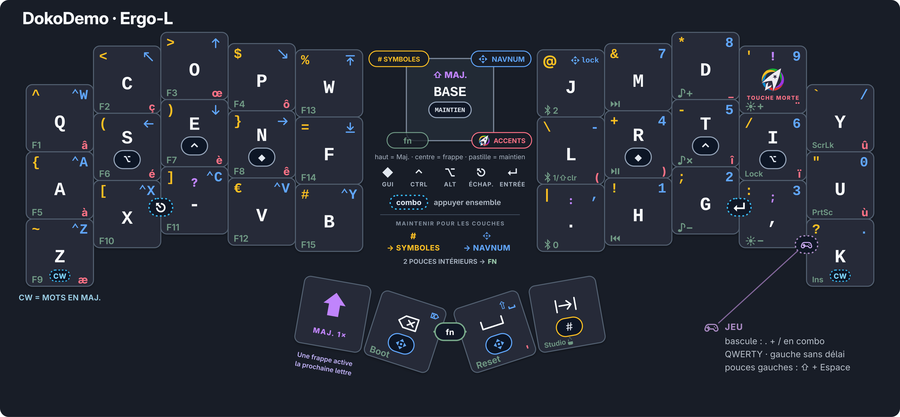
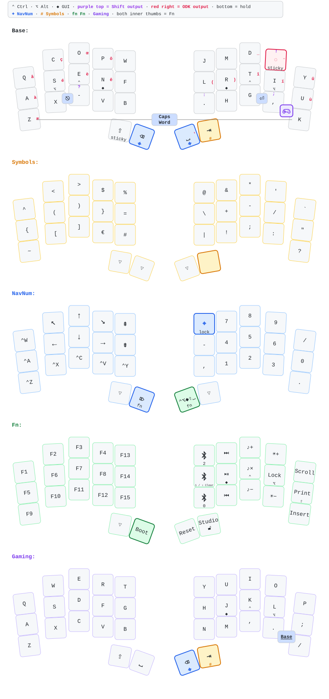

# Configuration DokoDemo de Tolki

Cette branche contient mon firmware et ma disposition pour le DokoDemo. Elle
implémente Ergo‑L au niveau du firmware sur un système configuré en QWERTY, tout
en conservant les couches compactes inspirées de Selenium de la disposition
d'origine.

Points principaux :

- modificateurs bilatéraux sur la rangée de repos, dans l'ordre Alt, Ctrl, GUI ;
- ponctuation Ergo‑L adaptée avec Shift et couche de touche morte unique pour
  les lettres accentuées ;
- Shift persistant et touches de pouce Retour arrière/Espace donnant accès à
  NavNum ;
- couche commune pour la navigation et le pavé numérique ;
- couches Symboles et Fn/Médias inspirées de Selenium ;
- combos pour Caps Word, Échap et Entrée ;
- couche de jeu QWERTY activable, avec une touche Espace dédiée au pouce
  gauche.

[Télécharger la version SVG](keymap-drawer/keymap-compact.svg).

## Disposition détaillée



## Génération de la disposition

Pour régénérer la disposition analysée et les fichiers SVG :

```sh
make keymap
```

Cette commande crée également `keymap-drawer/keymap-compact.svg` : une vue du
clavier physique regroupant, par couleur, les actions de toutes les couches
utiles. Utilisez `make keymap-compact` pour actualiser uniquement ce SVG
composite destiné au partage.

Pour créer le PNG de 3 840 px suivi par Git et affiché ci-dessus :

```sh
make keymap-compact-png
```

Cette exportation facultative nécessite `rsvg-convert`, fourni par librsvg. Si
nécessaire, indiquez son chemin avec
`RSVG_CONVERT=/chemin/vers/rsvg-convert`.

La génération utilise l'exécutable `keymap` installé globalement. Enregistrer
`keymap-drawer/keymap.yaml` dans VS Code redessine également le SVG lorsque
l'extension Run on Save recommandée est installée.

Pour créer un PDF A4 prêt à imprimer :

```sh
make keymap-print
```

Le PDF est enregistré dans `keymap-drawer/keymap-print.pdf`. Cette cible
nécessite GNU Make, l'exécutable global `keymap`, Python 3 avec PyYAML et
Chromium. Si l'exécutable porte un autre nom, définissez
`CHROMIUM=/chemin/vers/le/navigateur`.
